# HTB Academy Write-up: Information Gathering - Web Edition

**Author:** OULGRISS ABDELLAH
**Date:** October 04, 2025 
**Platform:** Hack The Box Academy  
**Module:** Information Gathering - Web Edition

## Overview

This document details the methodology and results for the "Information Gathering - Web Edition" module from Hack The Box Academy. The objective was to master passive and active reconnaissance techniques against web targets, covering WHOIS lookups, DNS enumeration, subdomain bruteforcing, virtual host discovery, web fingerprinting, and the use of web archives.

## Tools Used

- `whois` - Domain registration information
- `dig` - DNS record enumeration
- `Sublist3r` - Subdomain discovery
- `ffuf` - VHost and directory bruteforcing
- `curl` - HTTP header inspection
- `whatweb` - Web technology fingerprinting
- `ReconSpider` - Custom crawling and reconnaissance
- `gobuster` - Directory/VHost enumeration


## 1. Utilising WHOIS

### Objective: Query domain registration details.

**Q1: Perform a WHOIS lookup against the paypal.com domain. What is the registrar Internet Assigned Numbers Authority (IANA) ID number?**

```bash
whois paypal.com
```
*Searched the output for the IANA ID field.*

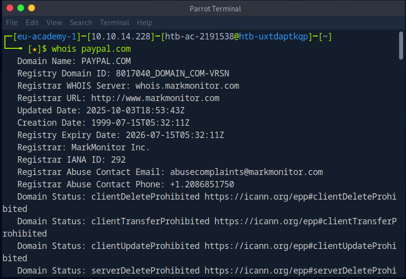

**Answer:** `292`


**Q2: What is the admin email contact for the tesla.com domain?**

```bash
whois tesla.com | grep mail
```
*Parsed the output for the administrative contact email.*
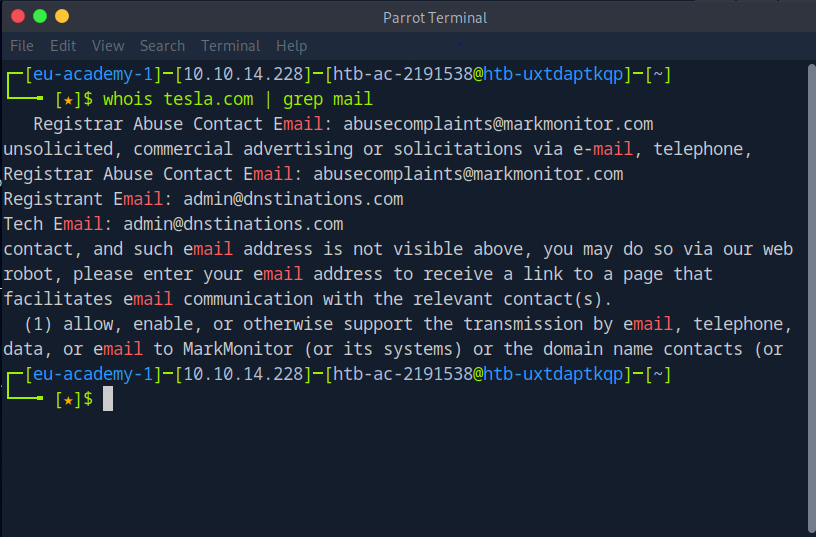

**Answer:** `admin@dnstinations.com`


## 2. Digging DNS

### Objective: Master DNS interrogation techniques.

**Q1: Which IP address maps to inlanefreight.com?**

```bash
dig inlanefreight.com +short
```
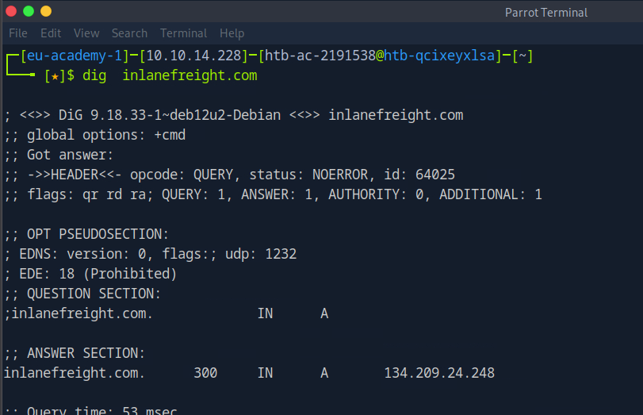
**Answer:** `134.209.24.248`


**Q2: Which domain is returned when querying the PTR record for 134.209.24.248?**

```bash
dig -x 134.209.24.248 +short
```
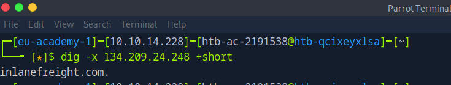

**Answer:** `inlanefreight.com`


**Q3: What is the full domain returned when you query the mail records for facebook.com?**

```bash
dig facebook.com MX +short
```
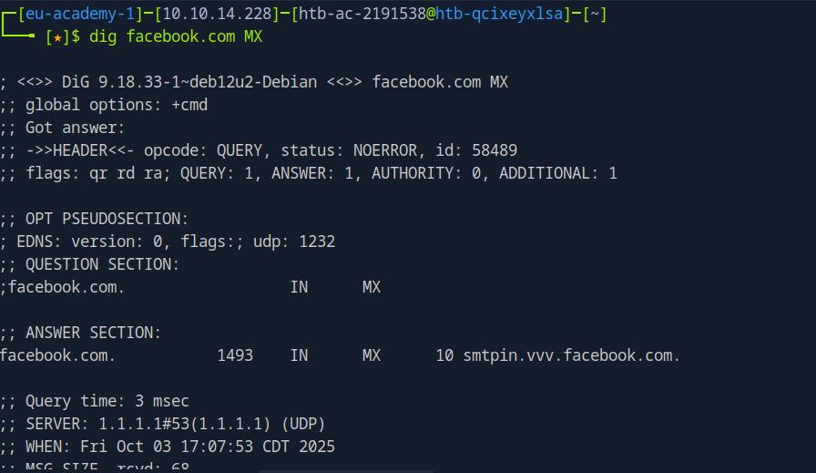

**Answer:** `msgin.vvv.facebook.com`


## 3. Subdomain Bruteforcing

### Objective: Discover hidden subdomains.

**Q1: Using the known subdomains for inlanefreight.com, find any missing subdomains by brute-forcing.**

```bash
sublist3r -d inlanefreight.com | grep inlanefreight.com
```
*Used Sublist3r with the default wordlist to discover new subdomains.*

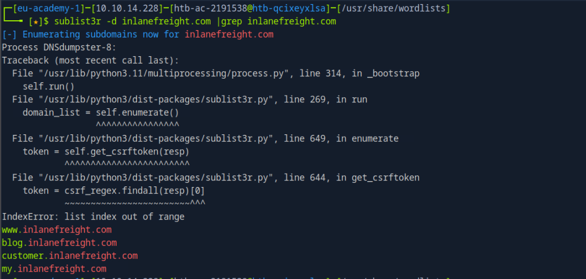

**Answer:** `my.inlanefreight.com`


## 4. DNS Zone Transfers

### Objective: Exploit misconfigured DNS servers.

**Q1: After performing a zone transfer for the domain inlanefreight.htb on the target system, how many DNS records are retrieved?**

```bash
# First, find the name servers
dig @10.129.42.195 inlanefreight.htb NS +short

# Then, attempt a zone transfer
dig @10.129.42.195 axfr inlanefreight.htb
```


*Counted the number of resource records returned in the zone transfer.*

**Answer:** `22`


**Q2: Within the zone record, find the IP address for ftp.admin.inlanefreight.htb.**

*Located the `A` record for `ftp.admin.inlanefreight.htb` in the zone transfer output.*

**Answer:** `10.10.34.2`


**Q3: Within the same zone record, identify the largest IP address allocated within the 10.10.200 IP range.**

*Reviewed all `A` records in the `10.10.200.0/24` range from the zone data.*

**Answer:** `10.10.200.14`


## 5. Virtual Hosts

### Objective: Discover hidden websites using VHost bruteforcing.

**Methodology:** Used `ffuf` to bruteforce subdomains, specifying the target IP and using the `Host` header.

```bash
ffuf -u http://94.237.57.155:42456/ -H "Host: FUZZ.inlanefreight.htb" -w /usr/share/wordlists/seclists/Discovery/DNS/subdomains-top1million-110000.txt
```

**Q1: What is the full subdomain that is prefixed with "web"?**  
**Answer:** `web17611.inlanefreight.htb`

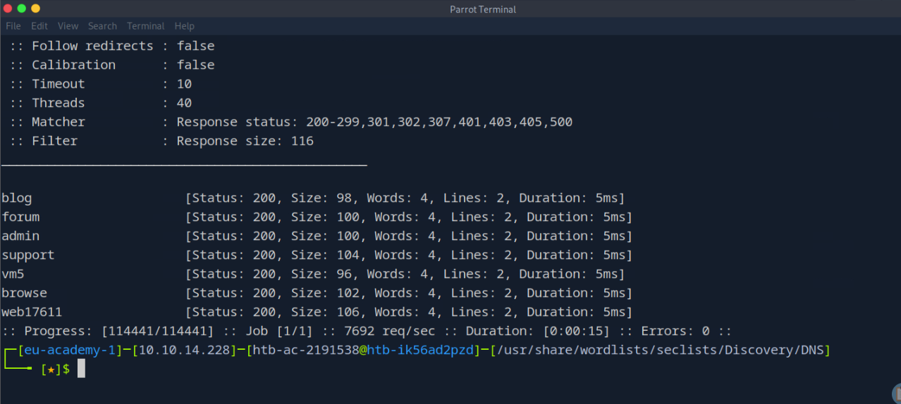

**Q2: What is the full subdomain that is prefixed with "vm"?**  
**Answer:** `vm5.inlanefreight.htb`

**Q3: What is the full subdomain that is prefixed with "br"?**  
**Answer:** `browse.inlanefreight.htb`

**Q4: What is the full subdomain that is prefixed with "su"?**  
**Answer:** `support.inlanefreight.htb`

**Q5: What is the full subdomain that is prefixed with "a"?**  
**Answer:** `admin.inlanefreight.htb`


## 6. Fingerprinting

### Objective: Identify web technologies and servers.

**Q1: Determine the Apache version running on app.inlanefreight.local.**

*First, added the hosts to the local `/etc/hosts` file.*

```bash
echo "10.129.161.95 app.inlanefreight.local dev.inlanefreight.local" | sudo tee -a /etc/hosts

curl -I http://app.inlanefreight.local/
```
*Examined the `Server` HTTP response header.*

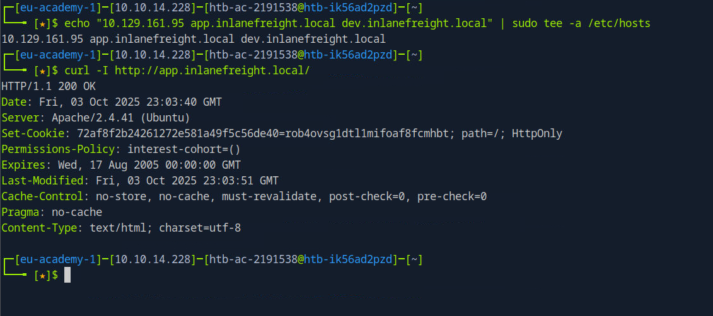

**Answer:** `2.4.41`


**Q2: Which CMS is used on app.inlanefreight.local?**

```bash
whatweb http://app.inlanefreight.local
```
*Identified the CMS from the `MetaGenerator` tag.*

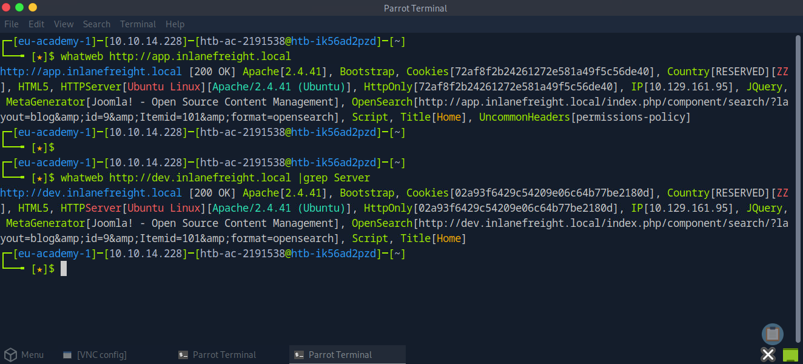

**Answer:** `Joomla`


**Q3: On which operating system is the dev.inlanefreight.local webserver running?**

```bash
whatweb http://dev.inlanefreight.local
```
*The `Server` header revealed the OS information.*

**Answer:** `Ubuntu`


## 7. Creepy Crawlies

### Objective: Use automated tools for reconnaissance.

**Q1: After spidering inlanefreight.com, identify the location where future reports will be stored.**

*Used the ReconSpider tool to crawl the domain.*

```bash
wget -O ReconSpider.zip https://academy.hackthebox.com/storage/modules/144/ReconSpider.v1.2.zip
unzip ReconSpider.zip
python3 ReconSpider.py http://inlanefreight.com
```
*Searched the generated `results.json` file for relevant data storage locations.*

**Answer:** `inlanefreight-comp133.s3.amazonaws.htb`


## 8. Web Archives

### Objective: Leverage historical web data.

**Q1: How many Pen Testing Labs did HackTheBox have on the 8th August 2018?**  
*Used the Wayback Machine to view the historical page.* 

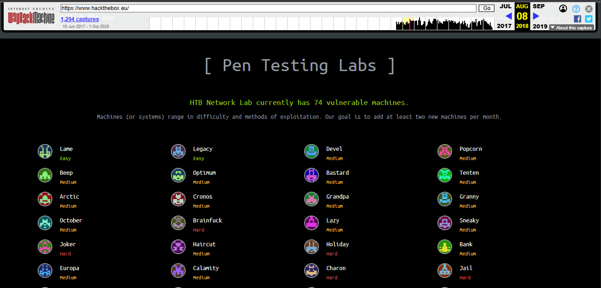

**Answer:** `74`

**Q2: How many members did HackTheBox have on the 10th June 2017?**  
**Answer:** `3054`

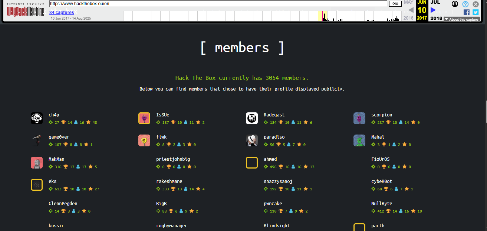

**Q3: Going back to March 2002, what website did the facebook.com domain redirect to?**  
**Answer:** `http://site.aboutface.com/`

**Q4: According to the paypal.com website in October 1999, what could you use to "beam money to anyone"?**  
**Answer:** `Palm Organizer`

**Q5: Going back to November 1998 on google.com, what address hosted the non-alpha "Google Search Engine Prototype"?**  
**Answer:** `http://google.stanford.edu/`

**Q6: Going back to March 2000 on www.iana.org, when exactly was the site last updated?**  
**Answer:** `17-December-99`

**Q7: According to wikipedia.com snapshot taken on February 9, 2003, how many articles were they already working on in the English version?**  

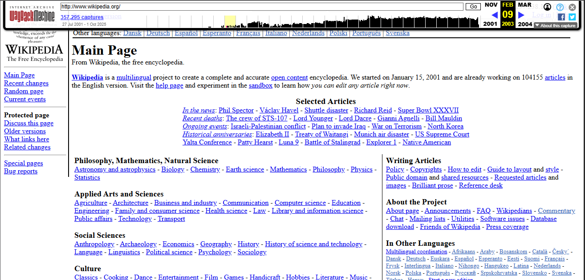

**Answer:** `104155`


## 9. Skills Assessment

### Objective: Apply all learned techniques in a comprehensive assessment.

**Q1: What is the IANA ID of the registrar of the inlanefreight.com domain?**

```bash
whois inlanefreight.com
```
*Located the Registrar IANA ID in the WHOIS record.*

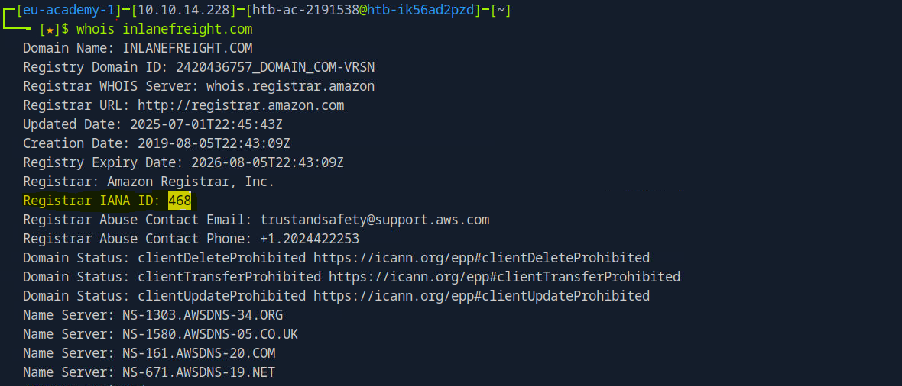

**Answer:** `468`


**Q2: What http server software is powering the inlanefreight.htb site on the target system?**

```bash
# Added target to /etc/hosts first
curl -I http://inlanefreight.htb:44038
```
*Identified the server from the `Server` header.*

**Answer:** `nginx`


**Q3: What is the API key in the hidden admin directory that you have discovered on the target system?**

*Used `gobuster` for VHost enumeration and discovered the `robots.txt` file, which revealed hidden paths. One of these paths contained the API key.*

```bash
gobuster vhost -u http://inlanefreight.htb:44038 -w /usr/share/seclists/Discovery/DNS/subdomains-top1million-110000.txt --append-domain -t 50
```
*Then visited the discovered paths to find the key.*

**Answer:** `e963d863ee0e82ba7080fbf558ca0d3f`


**Q4: After crawling the inlanefreight.htb domain on the target system, what is the email address you have found?**

*Used ReconSpider to crawl the target domain and extracted the email from the resulting `results.json` file.*

```bash
python3 ReconSpider.py http://dev.web1337.inlanefreight.htb:44038
cat results.json
```

**Answer:** `1337testing@inlanefreight.htb`


**Q5: What is the API key the inlanefreight.htb developers will be changing too?**

*Found the new API key within the `results.json` file generated by ReconSpider.*

**Answer:** `ba988b835be4aa97d068941dc852ff33`


## Key Takeaways

- A methodical approach to information gathering is crucial for successful penetration tests.
- Combining multiple tools and techniques (passive DNS, active subdomain enumeration, VHost bruteforcing) provides a comprehensive view of the target's attack surface.
- Historical data from web archives can reveal sensitive information no longer available on live sites.
- Automated reconnaissance tools are powerful, but manual verification and analysis are essential.

