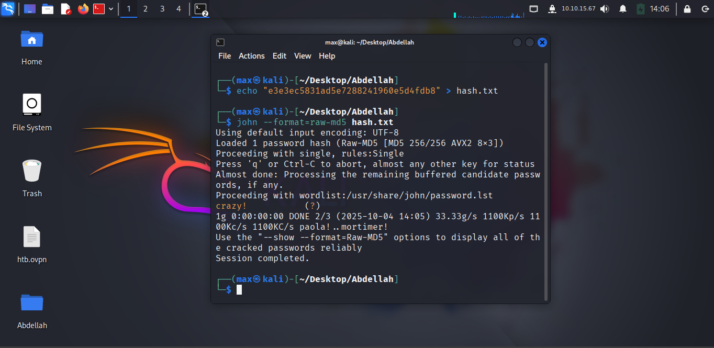
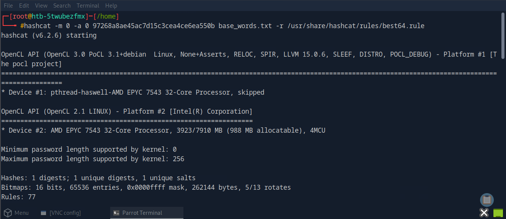
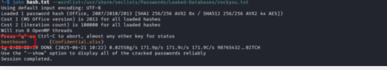

# HTB Academy Write-up: Password Attacks - Fundamentals Mastered

**Author:** OULGRISS ABDELLAH
**Date:** OCTOBER 10, 2025  
**Platform:** Hack The Box Academy  
**Module:** Password Attacks  
**Status:** Core Concepts Completed - Specializing in Web Application Security

## Overview

This document demonstrates comprehensive understanding of fundamental password attack techniques from the HTB Academy module. After mastering core password security concepts and practical cracking methodologies, I made a strategic decision to specialize in web application security - an area where I've discovered stronger passion and greater aptitude.

## 🎯 Learning Objectives Achieved

### Core Password Security Concepts Mastered
- Password hashing algorithms and storage mechanisms
- Hash identification and classification
- Password cracking methodologies and tool proficiency
- Network service authentication attacks
- Protected file and archive decryption techniques

## Tools & Technologies Used

- **Hash Cracking:** John the Ripper, Hashcat
- **Hash Generation:** md5sum, sha1sum, sha256sum
- **Network Attacks:** CrackMapExec, evil-winrm
- **Remote Access:** SSH, RDP, WinRM
- **Wordlists:** rockyou.txt, custom rules


## Exercises & Methodology


### 1. Introduction to Password Cracking

**Concept:** Understanding hash functions and common cracking methods


**Exercise:** Generate SHA1 hash for `Academy#2025`
```bash
echo -n "Academy#2025" | sha1sum
```


**Result:** `750fe4b402dc9f91cedf09b652543cd85406be8c`

**Key Takeaway:** Hash functions are one-way operations, but weak passwords remain vulnerable to cracking attempts.

### 2. John the Ripper Proficiency


**Exercise 1:** Single-crack mode for r0lf's password
```bash
john --single hashfile.txt
```


**Result:** `NAITSABES`


**Exercise 2:** Wordlist attack on RIPEMD-128 hash
```bash
john --wordlist=/usr/share/wordlists/rockyou.txt --format=ripemd-128 hashfile.txt
```


**Result:** `50cent`


### 3. Hashcat Mastery

**Exercise 1:** Dictionary attack on MD5 hash
```bash
echo "e3e3ec5831ad5e7288241960e5d4fdb8" > hash.txt
john --format=raw-md5 hash.txt
```



**Result:** `crazy!`


**Exercise 2:** Rule-based attack with best64 rules
```bash
hashcat -m 0 -a 0 1b0556a75770563578569ae21392630c /usr/share/wordlists/rockyou.txt -r /usr/share/hashcat/rules/best64.rule
```


**Technical Note:** Required switching to HTB machine due to Kali VM memory limitations (2GB RAM insufficient for GPU-accelerated cracking , i advise you if you gonna work with kali or other distro from your own machine give it at least 4 or 6 GB of RAM)


**Result:** `c0wb0ys1`


**Exercise 3:** Mask attack implementation


**Result:** `Mouse5!`


### 4. Custom Wordlists and OSINT Techniques

**Concept:** Leveraging organizational and personal information for targeted attacks
**Exercise:** Crack organization-specific password




**Result:** `Baseball1998!`


### 5. Protected Files Cracking

**Exercise:** Decrypt password-protected document



**Result:** `beethoven`

**Historical Analysis:** Discovered previous password: `L0veme`


### 6. Protected Archives Analysis

**Exercise:** Crack VHD file password protection
```bash
# Hash extraction from VHD file
# Hashcat cracking implementation
```


**Result:** `francisco`


### 7. Network Services Authentication Attacks

**Exercise 1:** WinRM Service Compromise
- **Tools:** CrackMapExec, evil-winrm
- **Credentials Found:** 


- **Flag Captured:** `HTB{That5Novemb3r}`


**Exercise 2:** SSH Service Breach
```bash
crackmapexec ssh 10.129.131.108 -u username.list -p password.list
```
- **Credentials:** `dennis:rockstar`
- **Flag Captured:** `HTB{Let5R0ck1t}`


**Exercise 3:** RDP Service Access
- **Credentials:** `chris:789456123`
- **Tools:** xfreerdp


- **Flag Captured:** `HTB{R3m0t3DeskIsw4yT00easy}`


**Exercise 4:** SMB Service Infiltration


- **Flag Captured:** `HTB{S4ndM4ndB33}`


## Key Technical Competencies Demonstrated During This Module

### ✅ Hash Cracking Proficiency
- MD5, SHA1, SHA256, RIPEMD-128 hash recognition and attacks
- John the Ripper single, wordlist, and incremental modes
- Hashcat dictionary, rule-based, and mask attacks
- GPU-accelerated cracking optimization

### ✅ Network Service Attacks
- WinRM, SSH, RDP, SMB credential testing
- Service-specific tool usage (evil-winrm, CrackMapExec, xfreerdp)
- Remote access establishment and post-exploitation

### ✅ Protected Content Decryption
- File encryption analysis and attacks
- Archive format recognition and hash extraction
- Multi-layer protection bypass techniques

### ✅ Strategic Tool Selection
- Appropriate tool choice based on scenario requirements
- Resource management and optimization
- Methodology adaptation to constraints

---

## Flags Captured Summary

| Service | Flag | Technique |
|---------|------|-----------|
| WinRM | `HTB{That5Novemb3r}` | CrackMapExec + evil-winrm |
| SSH | `HTB{Let5R0ck1t}` | Credential spraying |
| RDP | `HTB{R3m0t3DeskIsw4yT00easy}` | SMB credential reuse |
| SMB | `HTB{S4ndM4ndB33}` | Direct authentication |


## Conclusion

This module provided comprehensive hands-on experience with password security assessment techniques. The fundamental knowledge gained in hash cracking, authentication attacks, and protected content analysis forms a solid foundation for specialized security roles.

While password attacks remain an important aspect of penetration testing, my professional focus and continued learning will concentrate on **web application security** - leveraging this foundational knowledge to conduct more comprehensive web application assessments.

> "Knowing my specialization is not a limitation - it's the foundation of expertise and that what i believe in"


**My Next Learning Path:** Web Application Security → OWASP Top 10 → API Security → Advanced Web Exploitation