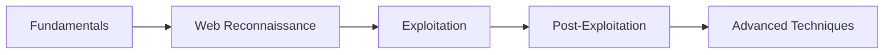

# My Cybersecurity Portfolio 🛡️

Welcome to my growing collection of cybersecurity write-ups, practical exercises, and learning milestones. This repository serves as a demonstration of my hands-on skills in penetration testing, vulnerability assessment, and security research.

## 🌟 About Me

My name is Abdellah ,A passionate cybersecurity enthusiast with a focus on practical offensive security skills. Currently building expertise through hands-on labs, CTF challenges, and continuous learning. Preparing for cybersecurity roles with a strong foundation in both reconnaissance and exploitation techniques.

## 📚 Portfolio Contents

### HTB Academy Write-ups

| Module | Description | Skills Demonstrated |
|--------|-------------|---------------------|
| **[Information Gathering - Web Edition](Information-Gathering-Web-Edition.md)** | Comprehensive web reconnaissance techniques | DNS enumeration, subdomain discovery, virtual host brute-forcing, web fingerprinting, OSINT |
| **[Using the Metasploit Framework](Metasploit-Framework-Writeup.md)** | Mastery of exploitation and post-exploitation | Metasploit framework, exploit development, payload delivery, privilege escalation, Meterpreter |
| **[Password Attacks - Fundamentals](Password-Attacks-Writeup.md)** | Core password security and cracking techniques | Hash cracking, John the Ripper, Hashcat, network authentication attacks, protected file decryption |
| **[Hacking WordPress](Hacking_WordPress_Writeup.md)** | Comprehensive WordPress penetration testing | WordPress enumeration, plugin vulnerability assessment, WPScan usage, theme editor exploitation, RCE techniques |

### Skills Demonstrated

**🔍 Reconnaissance & Enumeration**
- WHOIS and DNS analysis
- Subdomain enumeration with Sublist3r
- Virtual host discovery with ffuf
- DNS zone transfer exploitation
- Web technology fingerprinting
- Historical data analysis via web archives

**⚡ Exploitation & Post-Exploitation**
- Metasploit framework proficiency
- Exploit research and deployment
- Payload selection and delivery
- Session management and pivoting
- Privilege escalation techniques
- Credential harvesting and hash dumping

**🔐 Password Security & Authentication**
- Hash recognition and cracking (MD5, SHA1, SHA256, RIPEMD-128)
- John the Ripper and Hashcat proficiency
- Network service credential attacks (WinRM, SSH, RDP, SMB)
- Protected file and archive decryption
- Custom wordlist creation and OSINT-driven attacks

**🛠️ Tools & Technologies**
- **Reconnaissance:** whois, dig, Sublist3r, ffuf, whatweb, ReconSpider
- **Exploitation:** Metasploit Framework, Meterpreter
- **Scanning:** nmap, gobuster
- **Web Analysis:** curl, browser dev tools

## 🎯 Current Focus

- Advancing web application penetration testing skills
- Learning advanced exploitation techniques
- Developing professional reporting and documentation skills
- Preparing for cybersecurity roles in German companies

## 📈 Learning Path

## 🏆 Certifications & Achievements

- **eJPT** (eLearnSecurity Junior Penetration Tester) - *Completed*
- **HTB Academy** - Multiple modules in progress
- Building practical portfolio through hands-on labs
- **CPTS (Certified Pentetration Tester Specialist)** - Now Preparing to pass the exam and get certified

## 🔗 Connect With Me

## 🚀 Getting Started

To explore my work:

1. **Browse the write-ups** above to see detailed methodologies
2. **Review the screenshots** for practical demonstration
3. **Check back regularly** as I add new content

## 📝 Latest Updates

- **October 2025**: Added comprehensive HTB Academy write-ups
- **Ongoing**: Expanding portfolio with additional modules and CTF write-ups

### 🌍 For German Companies / Auf Deutsch

Ich bereite mich derzeit auf Positionen in der Cybersicherheit in Deutschland vor und baue meine praktischen Fähigkeiten in den Bereichen:

- Penetration Testing
- Schwachstellenanalyse
- Netzwerksicherheit
- Web Application Security

Meine praktischen Fähigkeiten und meine Lernbereitschaft machen mich zu einem idealen Kandidaten für Einsteigerpositionen in Ihrem Sicherheitsteam.

### ⚡ "The best way to predict the future is to create it." - Abraham Lincoln

**Always learning, always growing** 🚀